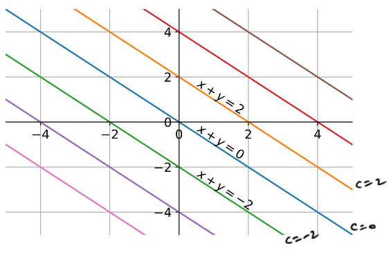

# Basic Concept

**Sample space**
A sample space S is a set. The elements of the set S will be called "outcomes" and should be viewed as a listing of all possibilities that might occur. We will call the process of actually one of the outcomes an "experiement"

**Event**

An event is a subset of the sample space. there is a technical resitriction on what subsets can be events.
Given a sample space S, an "event" is any subset E $`\subset`$ S
"Event" includes both S, the sample space itself, and $`\varnothing`$, the empty set.

**Probability**
function p that assigns to each event a real number between 0 to 1. The entire probability space (sample space, events and probablity function) should satisfy two axioms, which are specificed below.

**Probability Space Axioms**
Let S be a sample space and let F be collection of all events
A probability is a function $`P : F \rightarrow [0,1]`$

1. P(S) = 1; and
2. If $`E_1, E_2, ....`$ are counatable collection of disjoint events (That is, $`E_i \cap E_j = \varnothing`$ if $`i \neq j`$ , then $`P(\cup_{j=1}^\infty E_j ) = \sum_{j=1}^\infty P(E_j)`$

Explanation:

- for second axioms, probabilities add when combining a countable number of disjoint events. It is implicit that the series on right hand side of the equation converges.

## Basic properties

1. **Empty Set** :  P($`\varnothing`$) = 0;
3. **Complement** : If $`E_1, E_2, E_3 ... E_n`$ are finite collection of disjoint events, Then $`P(\cup_{j=1}^\infty E_j ) = \sum_{j=1}^\infty P(E_j)`$
4. **Subset** : If E and F are events with $`E \subset F`$, then P(E) $`\leq`$ P(F).
5. **Difference and Intersection** : If E and F are events with $`E \subset F`$, then P(F\E) = P(F) - P(E);
6. **Union and Intersection** : If E and F are events then P(E $`\cup`$ F) = P(E) + P(F) - P(E $`\cap`$ F).

Proof of (1)
The empty set is disjoint from itself, so $`\varnothing`$  is a countable disjoint collection of events.

**Equally Likely Outcomes**
When Sample space of only a countable collection of outcomes, describing the probability of each individual outcome is sufficient to describe the penalty of all events. This is because if A $`\subset`$ S we may simply compute P(A) = P($`\cup_{w \in A} \{w\}`$) = $`\sum_{w \in A} P(\{w\})`$

**Uniform**
Let S = {$`w_1, w_2, .. w_n`$} be a non-empty collection of disjoint events. If E $`\subset`$ S is any subset of S, let P(E) = $`\frac{|E|}{|S|}`$ (*where |E| represent the number of elements in E*) Then P defines a probability on S and P assigns probability to each individual outcome in S.
Finally, let w $`\in`$ S be any single coutcome and let E = {w}. Then P (E) = $`\frac{1}{|S|}`$, so every outcome in S is equally likely.

## Conditional Probability and Baye's Theorem

Let S be a sample space with probability P. Let A and B two events with P(B) > 0. Then the conditional probability of A given B written as P(A|B) and is defined by $`\frac{P(A \cap B)}{P(B)}`$

***Theorem :***
Let A be an event and let $`\{ B_i : 1 \leq i \leq n \}`$ be a disjoint collection of events for which $`P(B_i) > 0`$ for all i and such that $`A \subset \cup_{i=1}^n B_i`$. Suppose $`P(B_i)`$ and $`P(A|B_i)`$ are known, Then P (A)  may be computed as
$`P(A) = \sum_{i=1}^n P(A|B_i) P(B_i)`$

***Theorem :***
For an integer $`n \geq 2`$, let $`A_1, A_2, .. ,A_n`$ be a collection of events of which $`P(\cap^{j-1}_{j=1} A_j) = P(A1) . \pi^n_{j=2} P(A_j |(\cap^{j-1}_{k=1} A_k)`$

## Baye's Theorem

Suppose A is an event, $`\{ B_i : 1 \leq i \leq n \}`$ are a collection of disjoint events whose union contains all of A. Futher assume that P(A) > 0 and $`P(B_i) > 0`$ for all $`1 \leq i \leq n`$. Then for any $`1 \leq i \leq n`$,
$`P(B_i|A) = \frac{P(A|B_i)P(B_i)}{\sum^n_{j=1} P(A|B_j)} P(B_j)`$

**Independence**
Two events A dnd B are independent if $`P(A \cap B) = P(A)P(B)`$.
$`P(A|B) = P(A) = P(A|B^c)`$
$`P(A_1 \cap A_2 \cap A_3) = P(A_1)P(A_2)P(A_3)`$

**Mutual Indepedence**
A finite collection of events $`A_1, A_2, ... A_n`$ is a mutuallly independence if $`P(E_1 \cap E_2 \cap .... \cap E_n) = P(E_1)P(E_2) ... P(E_n)`$ whenewver $`E_j`$
is either $`A_j \text{ or }  A_j^c`$. An arbitary collection of events $`A_t`$, where t $`\in`$ I for some index set I is mutually independent if every finite subcollection is mutually independent.

# Sampling and Repeated Trails

## Bernoulli Trials

**setting** : occurence of Event A in a sample space is condidered "success". Non-occurence of A is considered "failure" Let p = P(A)

Bernoulli Trial : Sample space is {Success, failure} with P(Success) = p
This distribution is denoted Bernoulli(p)

**Repeated Beroulli trial**
*Seting* Repeat a Bernoulli trial multiple times independently.
Perform n independent Bernoulli(p) trials.
Outcome : 0 or 1 (Trial 1), 0 or 1 (Trial 2) ... 0 or 1 (Trial n)

> Probability use independence

## Binomial(n,p) Distribution

Perform n independent Bernoulli trials
Outcome number of success, which denoted B(n,p) or B in short
Sample Space (0,1,2, ..., n)

| | B=0| B=1|B=2|B=3|B=4|B=5|B=6|
|:---:|:---:|:---:|:---:|:---:|:---:|:---:|:---:|
|n=1| 1-p| p||||||
|n=2| $`(1-p)^2`$| $`2p(1-p)`$| $`p^2`$| ||||
|n=3| $`(1-p)^3`$| $`3p(1-p)^2`$| $`3p^2(1-p)`$| $`p^3`$ ||||
|n=4| $`(1-p)^4`$| $`4p(1-p)^3`$| $`6p^2(1-p)^2`$|$`4p^3(1-p)`$|$`p^4`$|||
|n=5| $`(1-p)^5`$| $`5p(1-p)^4`$| $`10p^2(1-p)^3`$|$`10p^3(1-p)^2`$ |$`5p^4(1-p)`$|$`p^5`$||
|n=6| $`(1-p)^6`$| $`6p(1-p)^5`$| $`15p^2(1-p)^4`$| $`15p^3(1-p)^3`$|$`15p^4(1-p)^2`$|$`6p^5(1-p)`$|$`p^6`$|

In general, B(n,p) = k
$`P(B(n,p) =k) = nC_k p^k (1-p)^{n-k} =\frac{n!}{k!(n-k)!} p^k (1-p)^{n-k}`$
> Some observation

- Start at $`(1-p)^n`$  -> increases and reaches a peak -> fall to $`p^n`$
- Peak is near $`np`$ Exactly at $`floor(p(n+1))`$
- P(B=0) + P(B=1) + ... P(B=n) = 1

## Geometric Distribution

Perform independent Bernoulli(p) trial indefinitely.
**Outcome** : NUmber of trails needed for first success, which we denote G(p) or G
**Sample space** : {1,2,3, ....}
**P(G=k)** = P(first k-1 trials result in 0 and k-th trial is 1)= $`(1-p)^{k-1}p`$

> Some Observation

- Starts at p and keeps falling
- Keeps on decreasing but if p<1, never goes all the way to zero
- $`P(G \leq k) = P(G=1 or .. or G =k ) = p +(1-p)p + (1-p)^2p + ... + (1-p)^{k-1}p  = 1- (1-p)^k`$

# Discrete Random Variables

 **Random Variable** numerical values computed from the outcomes of the experiment
A random variable is a function with domain as the sample space of an experiment and range as the real numbers. A function from sample space to real line. This technical condition that the function needs to satisfy, adn we will describe  that soon.

**Random variable and events**
If X is a random variable $`(X< x)= { s \in S : X(s)}`$ is an event for all real x So, $`(X>x) , (X=x), (X \leq x), (X \geq x)`$

Instead of trying to assign probabilities to the entire outcome, we will usually study random variable and assign probability  to events defined through them.

- This reduce the detail in the outcome to something simpler.
- Using limited data , only such random variables can ve studied.

## Discrete random variable and their distributions

The **Range of a random variable** is the set of values taken by it. Range is subset of the real line.

A random variable is said to be discrete if its range is a discrete set.

**distribution of discrete Probability mass function (PMF)**
the probability mass function (PMF) of discrete random variable (r.v) X with range set T is the function $`f_x(t) = P(X= t) \text{for  } t \in T`$

- (X = t)  is an event
  P(X =t) = P(all outcomes that result in X taking value t)
- Let B be a subset of T. consider taht result in X taking values in B) = $`\sum_{t \in B} P(X=t)`$

**Random Variable, Range and PMF**
Random variable X with range T = $`{t_1 ,t_2, t_3 .., t_k}`$. PMF $`f_x`$
| t | $`t_1`$| $`t_2`$|$`...`$ | $`t_k`$|
|$`f_x(t)`$|  $`f_x(t_1)`$| $`f_x(t_2)`$| $`...`$| $`f_x(t_k)`$|

> Properties of PMF

- $`0 \leq f_x(t) \leq 1`$  ($`f_x(t) = P(X=t)`$ is a probability )
- $`\sum_{t \in T} f_x(t) = 1`$ ($`P(X \in T) = 1`$)

Often random variables and their PMFs are studied without much mention of experiment or sample space.

- Events are defined using random Variable
- Prpbabilities evaluated using PMF.

# Common Distribution

---

## Uniform random variable

X ~ Uniform(T), where T is some finite set
Range: Finite set T
PMF : $`\frac{1}{|T|}`$ for all t $`\in T`$
Example :

- Toss a fair coin X ~ Uniform({0,1}), where 0 - heads and 1 -tails

## Bernoulli random variable

X ~ Bernoulli(p),  where $`0 \leq p \leq 1`$
Range : {0,1}
PMF : $`f_x(0) = 1 -p , f_x(1) = p`$
Example
Bernoulli Trail, p = prob of success, X ~ Bernoulli (p)

## Binomial random variable

X ~ Binomial(n,p), where n : positive integer, $`0 \leq p \leq 1`$
Range : {0,1,2, ... n}
PMF = $`f_x(k) = nC_k p^k (1-p)^{n-k}`$

Example

- Number of successes in n independent Bernoulli(p) trials.
- Check taht above PMF is valid
  - $`nC_k p^k (1-p)^{n-k} \geq 0`$
  - $`\sum nC_k p^k (1-p)^{n-k} = 1`$

## Geometric random variable

X ~ Geometric(p), where r: positive integer , $`0 < p \leq 1`$
Range : {r, r+1 , r+2}
PMF : $`f_x(k) = (k-1)C_{r-1} (1-p)^{k-r} p^r`$

Example

- Number of trials for first success in repeated independent trials
- check that above PMF is valid
- Start at 0 : some use range as {0,1,2 ...} and $`f_x(k) = (1-p)^k p`$

## Negative Binomial random variable

X ~ Negative Binomial (r,p) where r : positive number. $`0 < p \leq 1`$
Range: {r, r+1, r+2 ..}
PMF : $`f_k(k) = (k-1)C_{r-1} (1-p)^{k-r} p^r`$

Example

- Number of trials for r success in repeated independent Bernoulli trials
  - r= 1
- Check that the above PMF is valid
-

## Poission Random Variable

X ~ Poisson($`\lambda`$) , where $`\lambda > 0`$
Range : {0,1,2, ...}
PMF : $`f_x(k) =\frac{ e^{-\lambda} \lambda ^k} {k!}`$

## HyperGeometric random variable

X ~ HyperGeo(N, r, m), Where N, r, m are positive integer

- Consider a population of "N" persons with r of Type-1 and "N-r"of type 2
- select m persons uniformly at random without replacement
- X= number of person Type 1 selected
Range of X $`X \in max(0, m - (N-r), ... min(r,m)`$
PMF : $`f_x(k) = rC_k (N-r)C_{m-k} / Nc_m`$

## Poisson random variable : Queues and meteorites

### Function of a random variable

X : a random variaable with range T and PMF $`f_x(t)`$
X : function from sampe space to T
T : subset of real line
Let f(x) be a

## Two random variables

## Joint PMF

 Suppose X and Y are discrete variables defined in the same proability space. Let the rage of X and Y be $`T_x`$ and $`T_y`$, respectively. The joint PMF of X and Y, denoted $`f_{XY}`$, is a function from $`T_x \times T_y`$ to [0,1] defined as
 $`f_{XY}(t_1, t_2) = P(X = t_1 and Y = t_2), t_1 \in T_X, t_2 \in T_Y`$

- Joint PMF is usually written as a table or a matrix
- P(X= t_1 and Y = t_2)

Two random variable : Marginal PMF
Supposse X and Y are jointly random variables with joint PMF f_{XY}. The PMF of individual variables X and Y are called as marginal PMFs. It can be shown that
$`f_X(t) = P(X = t) = \sum_(t' \in T_Y f_{XY}(t,t'))`$
$`f_Y(t) = P(Y = t) = \sum_(t' \in T_X f_{XY}(t,t'))`$
Where $`T_X`$ and $`T_Y`$ are ranges of X and Y, respectively

- supposse $`T_Y`$ = {$`v_1, v_2, ... , y_k`$}
- $`(X=t) = (X=t \text{ and } Y = y_1) \text{or ... or } (X=t \text{ and } Y = y_k)`$
- Note that the marginal PMF is simply a PMF
- From joint we can drive the values for marginal from marginal, it is not possible to get the values of joint

## Conditional distribution of a random variable given an event

Suppose X is discrete random variable with range $`T_X`$ , and A is an event in the same probability space. the conditional PMF of X is given A is defined as the PMF.
$`Q(t) =  = P(X = t |A), t \in T_X`$
We will use notation $`f_{x|A}(t)`$ for the above conditional PMF, and (X|A) to denote the"conditional" random variable
$`f_{x|A} = \frac{P((X=t) \cap A)}{P(A)}`$

- Range of (X|A) can be different from T_x and will depend on A

### conditional distribution of one random variable given another

Supposse X and Y are jointly distributed discrete random variable with joint PMF $`f_{XY}`$. The conditional PMF of Y given X = t is defined as teh PMF
$`Q(t') = P(Y = t' | X = t) = \frac{Y = t' | X=t}{P(X=t)} = \frac{f_{XY}(t, t')}{f_x(t)}`$

We will use the notation $`f_{Y|X = t(t')}`$ for the above conditional PMF, and (Y|X = t) to denote the "conditional" random variable
$`f_{XY}(t, t') = f_{Y|X= t}(t') f_x(t)`$

## More discrete Variable

edit is later

# Independence of two random variable

Let X and Y are two random variables defined in a proababillity space with ranges $`T_x`$ and $`T_y`$, respectively. X and Y are said to be independent if an y event defined using X alone is independent of any event defined using Y alone. Equivalently, if the joint PMF of X and Y is $`f_{XY}`$, X and Y are independent if
$`f_{XY}(t_1, t_2) = f_x(t_1)f_y(t_2)`$ for $`t_1 \in T_x, t_2 \in T_y`$

- General case
  - $`f_{xy}(t_1,t_2)  = f_X(t_1)f_{Y|X = t1} (t_2)`$ (always true)
  - Independent : $`f_{Y|X t_2}(t_2) = f_y(t_2)`$

If X and Y are independent

- joint PMF equals product of marginal PMFs.
- Conditional PMF equals marginal PMF.

### Independent vs dependent random variables

- To show X and Y are idenpendent, verify $`f_{XY}(t_1, t_2) = f_X(t_1)f_Y(t_2)`$ for all $`t_1 \in T_X, t_2 \in T_Y`$
- To show X and Y are dependent, verify $`f_{XY}(t_1, t_2) \neq f_X(t_1)f_Y(t_2)`$ for some $`t_1 \in T_X, t_2 \in T_Y`$
- Special case: $`f_{XY}(t_1, t_2) = 0`$ when $`f_X(t_1) \neq 0 , f_Y(t_2) \neq 0`$

**Multiple Random Variable**
Let $`X_1, ...., X_n`$ be random variables defined in a probability space with range of $`X_i`$ denoted $`T_x_i`$. $`X_1, .. X_n`$ are said to be independent if  events defined using different $`X_i`$ are mutually independent. Equivalency, $`X_1, .. , X_n`$ are independent iff
$`f_{x_1, .... ,x_n} = f_x_1 (t_1) f_x_2(t_2) .... f_x_n(t_n)`$
if X and Y are independent

- Joint PMF equals product of marginal PMFs
- Condtional PMF equals unconditioned PMF
All  subsets of independent random variables are independent.

## idependent identically distributed

Random variables $`X_1, ... , X_n`$ are said to be independent and identically distributed (i.i.d) if

1. They are independent
2. The marginal  PMFs $`f_x_i`$ are indentical .

- Repeated trials of an experiment creates i.i.d sequence of random variables
  - Toss a coin multiple times
  - Throw a die multiple time

### IID Geometric

Let $`X_1, ...,X_2`$ be iid with a geometric(p) distribution.
X ~ Geometric(p) : $`X \in {1,2,3,4.....}`$
$`P(X=k) = (1-p)^{k-1}p`$
Let X ~ Geometric(p)

1. P(X>n) = $`(1-p)^n`$
2. P(X> m+n | X> m) = $`(1-p)^n = P(X>n)`$

### Visualizing function of random varaibles

***One random variable***
One-to-one: for different input, the function results in different outputs.

- In the plot of  y = f(x) versus x, every horizontal line intersects the curve only at one point.
- Monotonic function are one-to-one.
- Example : x-5 , $`2^x`$.

if f is one-to-one

- Easy to finsd PMF of f(x) using table method.
- Easy to visualize the plot of the PMF.
P(Y = f(x)) = P(X =x)

***Many-to-one functions***
For two or more different input, the function should result in the same output.

- In the plot of y = f(x) versus x, some horizontal line intersects the curve at more than one point.
- Non-monotonic functions are many-to-one
- Example : $`y =x^2, y = x(1-x), y = xe^{-x}`$

if f is many-to-one

- The table method will generally work...
- let $`y_0`$ be a value by f at the points $`x_1, x_2, ... , x_m`$ and nowhere else. that is $`y_0`$ f($`x_1`$) = $`f(x_m)`$

### Visualizing functions of 2 variables

- g(x,y): function
  - 3D plot is one option but often not very useful.
- Countours 1
  - values of (x,y) that result in g(x,y) = c
  - make plot of those (x,y) for different c
- regions
  - values of (x,y) that result in g(x,y) = c
  - make a plot of those (x,y) for differnt c

Conturs are quite useful in many problems

### Function of two random variables

let Z = g(x,y) be a function of X and Y
For PMF of Z

- find the range of Z
  - All possible values for g(x,y), $`x \in X , y \in Y`$
- add over the contours
  - Suppose z is a possible value taken by z
  $`P(Z =z) = \sum_{(x,y): g(x,y)=z} f_{xy}(x,y)`$

> Some important results
**Uniform {1, .. n}:**

X,Y ~ iid Uniform {1,2... n}, W = X+Y

1. Sum

  $`P(W=w) = \begin{aligned} \frac{w-1}{n^2} & 2 \leq w \leq n+1, \\ \frac{2n-w+1}{n^2}, & n+2 \leq w \leq 2n \end{aligned}`$

2. Max
$`P(Z=z) = \frac{2z-1}{n^2}`$

## Sum of two random varaible taking integer values

Suppose X and Y take integer values and let their joint PMF be $`f_XY`$. Let Z = X+Y
P(Z=z) = P(X+Y = z) = $`\sum_{x=-\infty}^\infty P(X=x, Y= z-x)`$ = $`\sum_{x=-\infty}^\infty f_{XY}(x,z-x)`$ = $`\sum_{y=-\infty}^\infty P(z-y,y)`$

**Convolution** : If X and Y are independent,
$`f_{X+Y}(z) = \sum_{x=-\infty}^\infty f_{x}(x)f_Y(z-x)`$

> Sum of two independent possions

Let X~ Poisson($`\lambda _{1}`$) and Y ~ Poisson($`\lambda_2`$) be independent.

Sum of Z = X+Y where $`Z \in {0,1,2 ...}`$
= Poisson($`\lambda _1 + \lambda_2`$)

Conditional distribution
X|Z = P(X=k| Z=n) = Binomial(n , $`\frac{\lambda _1}{\lambda_1 + \lambda _2}`$)

Y|Z = P(Y=k| Z=n) = Binomial(n,$`\frac{\lambda _2}{\lambda_1 + \lambda _2}`$)

## Independent case; Cumulative distribution function (CDF) of maximum

Cumlative distribution function of a random variable X is a function $`F_X ; \R \rightarrow [0,1] defined as`$
$`F_X(x) = P(X \leq x)`$

Suppose X and Y are independent and Z = max(X,Y)

# Excepted value of a discrete random variable

Suppose X is a discrete random variable with range $`T_X`$ and PMF $`f_x`$. The expected value of X, denoted E[X], is defined as
E[X] = $`\sum_{t \in T_X} t f_x(t)`$

- other names: mean of X
- E[X] may or may not belong to the range of X
- E[X]  has the same units as X

X ~ Bernoulli(P)
E[X]  = 0(1-p) + 1(p) = p

X ~ Uniform{1,2,3,4,5,6}
E[X] = $`1.\frac{1}{6} + 2. \frac{1}{6} +3.\frac{1}{6} + 4.\frac{1}{6} + 5. \frac{1}{6} + 6.\frac{1}{6}`$

value of a lottery ticket (in RS) is {200, 20 ,0}

X ~ Uniform{a,a+1,a+2...b}
E[X] = $`\frac{a+b}{2}`$

X ~ Geometric(p)
E[X] = $`\sum_{t=1}^{\infty} t(1-p)^{t-1}p`$

X ~ Poisson($`\lambda`$)
E[X] = $`\sum_{t=0}{\infty} t e^{-\lamda} \frac{\lambda ^t}{t!}`$
