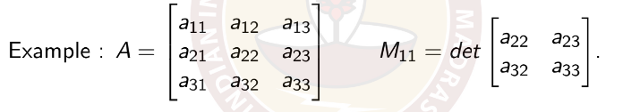
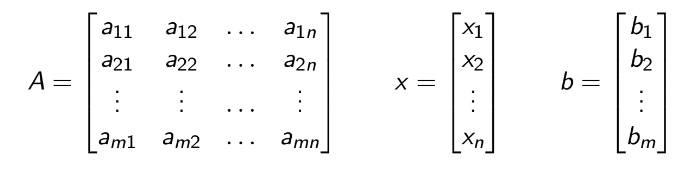

vectors

# Matrices

A matrix is a rectangular array of number, arranged in rows and columns.
Example : [ [ 1,2,3 ], [ 2,3,4 ] ]
This is a $`2 \times 3`$ (2 rows and 3 columns)

- An $`m \times n`$ has m rows and n columns
- (i,j)-th entry of a matrix is the entry occuring in the i-th row and j-th column

#### Square matix

A Square matrix is a matrix in which the number of row is the same as number of columns

- the i-th diagoal entry of square matrix is (i,i)-th entry
- The diagonal of a sqaure matrix is the set of diagonal entries.

#### Diagonal matrices

A square matric in which all entries except the diagonal are 0 called diagonal matrix

example : [[ 1,0,0 ], [ 0, -3, 0],[ 0,0,4.2 ]]

#### Scalar Matrices

A diagonal matrix in which all the entries are equal is called a scalar matrix.

example : [ [ -3,0,0 ], [ 0,-3,0 ], [ 0,0,-3]]

#### identity Matrx

A scalar matrix with all entries 1 is called indetity matrix  and is doneted by _I_

## Linear Equation

Any set of equation can be represented as  Ax = B

There are 3 possibilities for the solutions to a linear system of equation

- The system has infintely many solution
- The system has a unique solution
- The system has no solution

### Determinants

Every square matrix A has a number associated number, called its determinanat and denoted by _det(A) or_ |A|

- solving a system of linear equation
- finding the inversse of a matrix
- calculus and more

**Properties**
det(AB) = det(A) det(B)
det($`A^{-1}`$) = $`\frac{1}{det(A)}`$

- swithing of two rows or columns det(initial) = -  det(after)
- adding multiples of row to another row. det(initial) = det(after)
- mutiplying a row by scalar t = det(A) = t. det(A)
- det($`A^n`$) = $`det(A)^n`$
- det($`A^{-1}`$) = $`det(A)^-1`$
- det(AB) = det(BA)
- det($`A^T A`$)  = det$`(A)^2`$
- Switching two rows and columns changes the sign.
- the determinat of matrix with row or column of zeros is 0
- The determinant of a mtrix in which one row (or column) is a linear combination of other rows (resp column) is 0
- Scalar multiplication of a row bya constant t multiplies the determinat by t
- While computing the determinant along a suitable row or column.

The transpose of $`A_{m \times n}`$ is the $`n \times m`$ with (i,j)-th entry A_{ji}

Notation : $`A^T`$
Defination: $`(A^T)_{ij}= A_{ji}`$

det(A ) = det($`A^T`$)

Minors and Cofactors
if A is $`n \times n`$ square matrix with n $`\leq`$ 4. Then the minor of the entry in the i-th row and j-th column is determinanat of the submatrix by deleting the i-th row and j-th column.

name: the (i,j)-th minor
Notation : $`M_{ij}`$

The (i,j)-th cofactor $`C_{ij} = (-1)^{i+j} M_{ij}`$

## cramer's Rule

COnsider the following system of linear equations
$`4x_1 - 3x_2 =11 \\ 6x_1 +5x_2 = 7`$
Matrix representation : Ax = B
the matrix A is given by A = [[ 4, -3 ],[ 6,5 ]] , b = [ 11, 7]

> A must be invertible matrix

**steps**

- make coefficeint matrix A
- calculate det(A)
- Replace the first column of A by the column vector b and call it $`A_{x_1}`$
- Replace the second column of A by the vector b and call it $`A_{x_2}`$

Generally , $`A_{x_i}`$ to be matrix obtained by replacing the i-th column of A by the vetor b. cramer'r rule states the ubique solution is :
$`x_i= \frac{det(A_{x_i})}{det(A)}`$

## the solution of a system of linear equation with an invertible coefficient matrix

Let A be an $`n \times n`$ matrix. The inverse of A is another $`n \times n`$ matrix B such that AB = BA = $`I_{n \times n}`$ and is denoted by $`A^{-1}`$

Conclusion: inverse of A exists => det(A) has to be non-zero

### the adjugate of square matrix

The (i,j)-th minor is the determinat of the submatrix formed by deleting i-th row and j-th column.
the (i,j)-th  cofactor is ndefined as : $`C_{ij} = (-1)^{i+j} M_{aij}`$
The cofactor  matrix C is the matrix whsoe (i,j)-th entry is C_{ij}
The adjugate matrix of A is deined as : adj(A) = C^{T}

the $`A^{-1}`$ is computed by = $`\frac{1}{det(A)} adj(A)`$

***Solutions***

COnsider the system  of linear  eqautiopn of Ax=b where the coefficient matrix A is an invertiable matrix
Multiplying bith sides by $`A^{-1}`$ we obtain
Ax = b
x = $`A^{-1}b`$

***Homogeneous equations***

A system of linear equation is homogeneous if all of the constant terms are 0.b = 0

The matrix form of a homogeneous system is Ax= 0
If  A is ivertible matrix then multiplying both sides by $`A^{-1}`$. we obtain x = $`A^{-1} 0`$ = 0

A homogeneous  syste m of linear equation with n eqaution s in n unknowns

- has a unique solution 0 if its coeeficient matrix is invertible. i.e. its determinat is no-zero.
- has an infinite number of solutions if its coefficient matrix is not invertible. its determinant is 0.

## the echelon form

A general system of m linear equation with n unknowns can be written as

$`begin\equation a_{11} x_1 + a_{12} x_2 + a_{13} x_3 = b1 \\ a_{21} x_1 + a_{22} x_2 +...+ a_{23} x_3 = b2\\ . \\ .\\ . \\ a_{m1} x_1 + a_{m2} x_2 + a_{mn} x_n = b1`$

Matrix representaion of this system of linear eqaution is Ax=b where

A solution is an assignment of values for x so that the eqautions are satisfied.

### Reduced Row echelon form

A matrix is in row echleon form if:

- the first non-zero element in each row, called the leading entry is 1.
- Each leading entry is in an column to the right of leading entry in the previous row.
- Rows with all zero elements, if any, are below rows having a non-zero elememt.
- For a non-zero row, the leading entry in the row is the only non-zero in its column.

### Solutions of Ax =b when A is in reduced row echleon form

let Ax =b be a system of linear equation and suppose A is in reduced row echleon form.
Suppose for some i, $`i^{th}`$ row of A is a zero row but $`b_i \neq 0`$ Then this system has no solution.

Reason: This means if we write the corresponsing system of linear equations: the $`i^{th}`$ eqaution reads
$`0 x_1 + 0 x_2 + ... + 0 x_n = b_i`$
since $`b_i \neq 0`$ this cannot be satisfied.

Let Ax = b be a system of linear equations and suppose A is in reduced row echleon form.  
Assume that for every zero row of A, the corresponding entry of b is also 0 (i.e. if the $`i^{th}`$ row  of A is zero, so is $`b_i`$)

- If the i-th column has the leading entry of some row, we call $`x_i`$ a dependent variable
- if the i-th column does not have the leaading entry of some row , we call $`x_i`$ an idenpendent variable.
- Assign arbitary values to independent variables.
- For a dependent variable, there is a unique equation in which
it occurs. All other variables in that equation are independent
variables and thus have values assigned. Hence, we can
compute the value of the dependent variable from this
equation substituting the assigned values for the other
independent variables in the equation.
- The obtained value for $`x_i`$ give a solution to  the system.
- in fact every solution is obatined in this way.

Conclusion: If A is in reduced roe echleon form, this easy procedure provides us with all the solution of Ax= b.

## Row reduction

operation allowed

1. Interchange of two rows
2. Scalar multiplication of a row by a constant t.
3. Adding multiples of a row by another row.

For a sqaure matrix A:

Observe :
row reducing A into row echleon form produces an upper trangle matrix with diagonal entries all 1 (if it is invertible) or some 1s and 0s.

- Row reduce A into row echleon form.
- If the diagonal entries of the reduced matrix contain a 0, then
its determinant is 0 and tracing the determinant back along
the row reduction procedure shows that the determinant of A
must be 0.
- If the diagonal entries of the reduced matrix are all 1s its
determinant is 1. Tracing back along the procedure used to
row reduce using the table of how the determinant changes
according to elementary row operations, we can compute the
determinant of A.

#### the augmented matrix

Let Ax =b be a system of linear eqautions wher A is an $`m \times n`$ matrix and b is a $`m \times 1`$ column varctor.
the augemented matrix of this system is defined as the matrix of size $`m \times (n+1)`$ whose fiorst n columns are the columns of A and last column is b.
We denoted the argumented matrix by [A|b] and  put a vertcial line between the first n columns and the last column b while writting it.

## Guass Elimination Method

Consider the system of linear equations Ax= b

1. Form the augmented matrix of the system [A|b]
2. Perform the same operations on [A|b]  that we used to brinfg A into reduced row echleon form.
3. Let R be the submatrix of obtained matrix of the  first n columns and c be the submatrix of the obtained matrix consisting of the last column.

We write the obntained matrix as [R|c]. Notice that R is the reduced  row echelon matrix obtained by row reducing A.
> the solutioon sof Ax= b are preciesly solutoins of [R|c]

4. Form the corresponding  system of linear equations Rx=c
5. Find all the solutioons of Rx=c and hence of Ax= b

Since R is in reduced row echleon form. we can find ALL  its solutions (as described earlier)

### homogenous system of linear equations

0 is always a solution of homogenous system of linear equations Ax = 0. This solutions is called _trivial solution_

For a homogenous system, there are  two different possibilities:

- 0 is the unique solution
- there are infintely many solutions other than 0

In a homogeneous system of equations, if there are more variables that equations, then it is guaranteed. to have nontrivial solutions.

***Computing the inverse***

Computing the inverse of an invertibel matrix A is equivalent to : finding solution of $`A_x = [1.0.0]`$, $`A_y =[0,1,0]`$, $`A_z = [0,0,1]`$
